🎯 Core Features

🌟 Events

Users can:
- Comment on events.
- All events are visible to users for interaction.
Trainers can:
- Add new events.
- Edit or delete events they created.

❗Event is deleted when its date of starting passes 

🏋️‍♂️ Training Programs

Users:
- Rate programs (provide feedback to trainers).
- Like programs they find useful.

Trainers:
- Create, edit, and delete training programs.
- Manage programs to suit their expertise and audience needs.

⚙️ Admin Page
- Full administrative control over users, roles, events, programs and comments.

📚 Usage
User Roles

User
- Interact with events and rate/like training programs.

Trainer
- Manage their own events and training programs.

Admin
- Oversee all user roles, events, and programs via the admin page.

❗ User can become Trainer by filling in a field with his phone number 

🧑‍💻 Technologies Used

- C#

- .NET 8

- ASP.NET
  
- Entity Framework Core

- CSS, HTML, JavaScript

🛡️ You can test my app with these four accounts:

- email: user@gmail.com, password:User1234

- email: user1@gmail.com, password:User1234

- email: trainer@gmail.com, password:Trainer1234

- email: admin@gmail.com, password:Admin1234

📷 Screenshots!

User View:
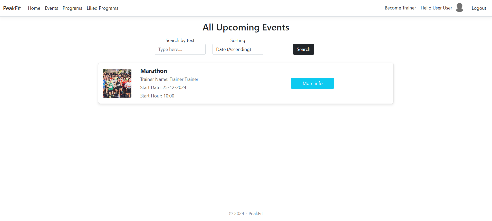
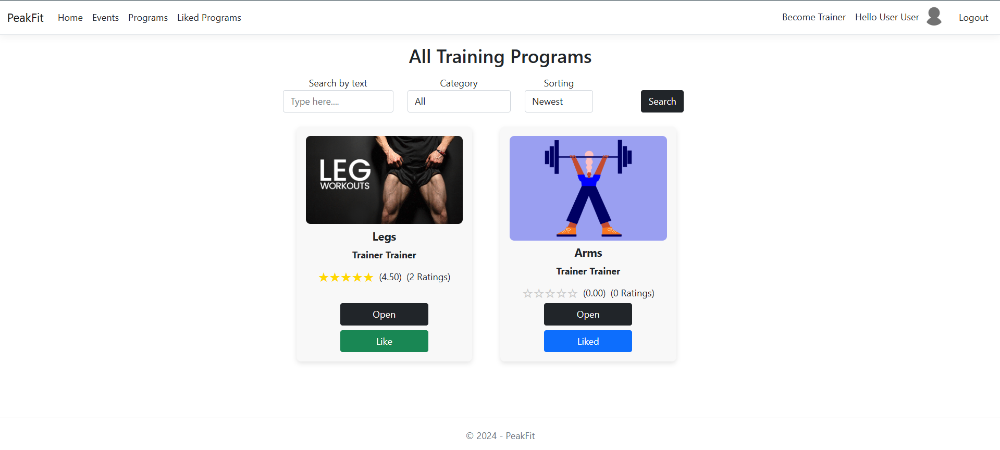
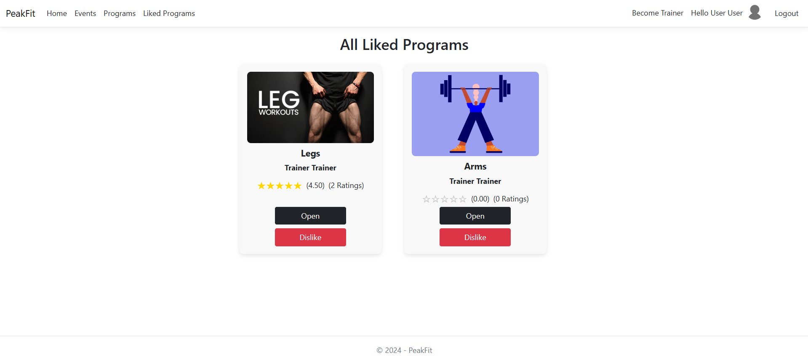

- Become Trainer Section:
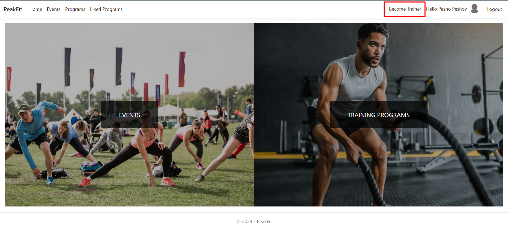
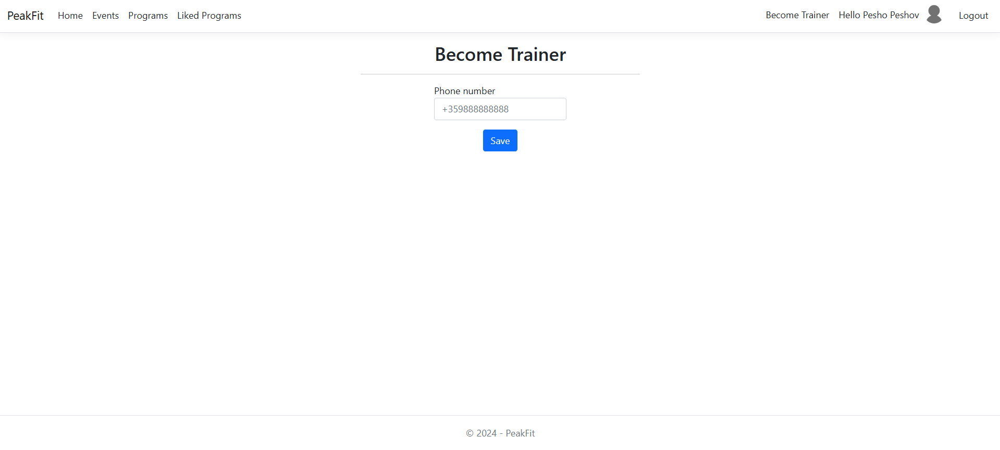 

Event details and comments:
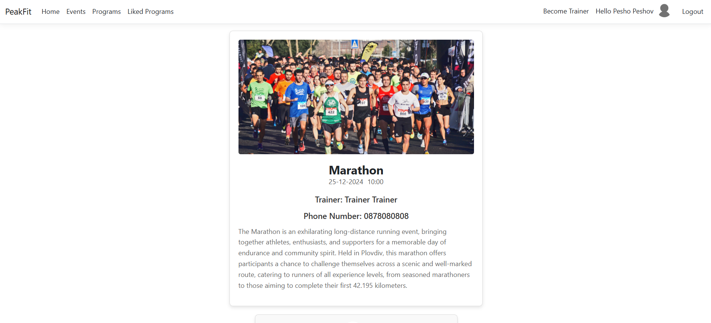
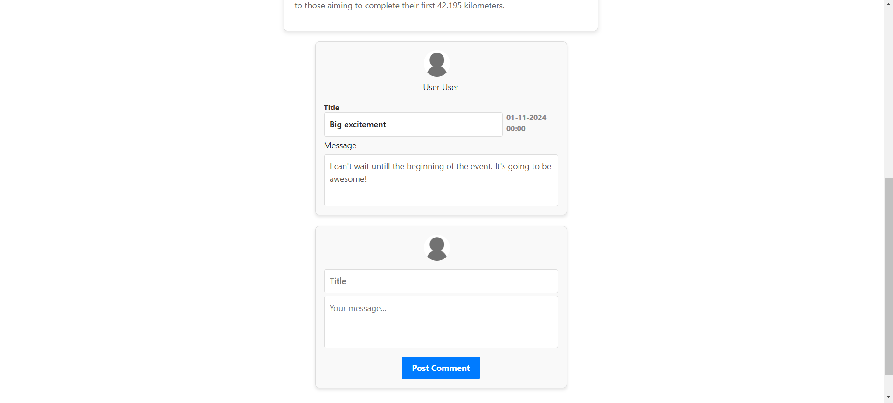

Training programs details:
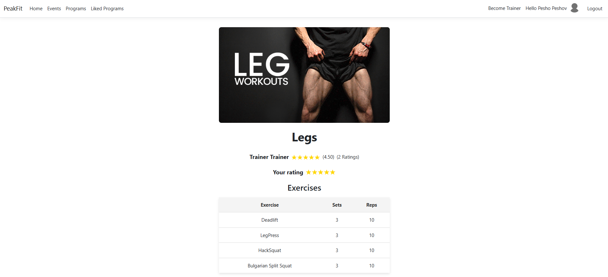

Trainer View:

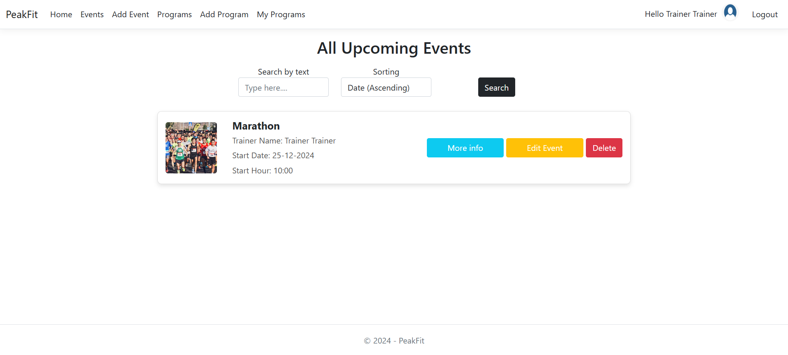
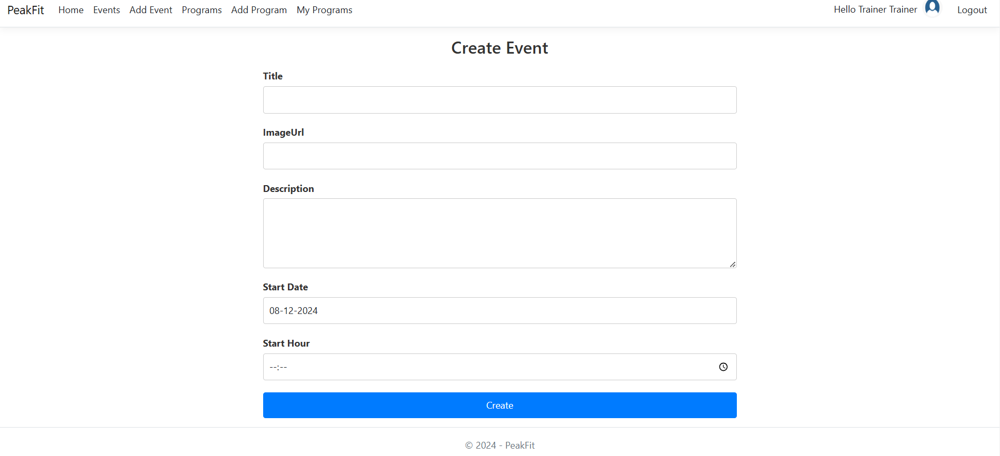
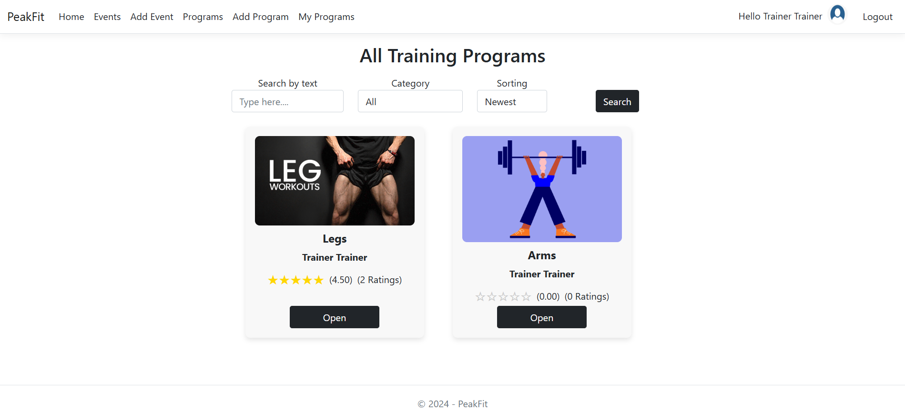
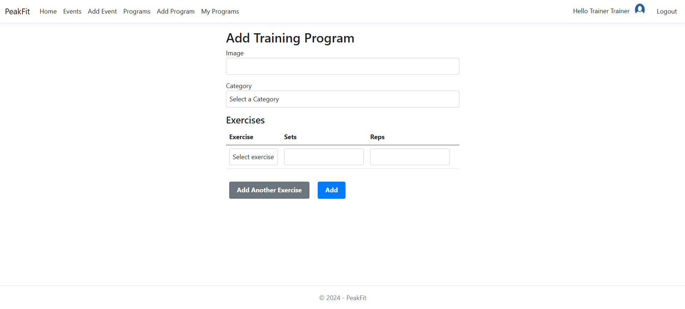
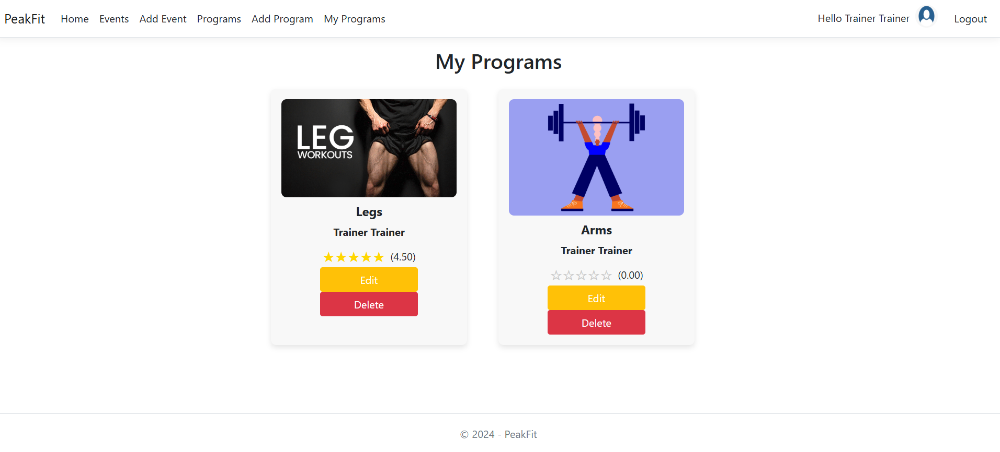

Admin View:
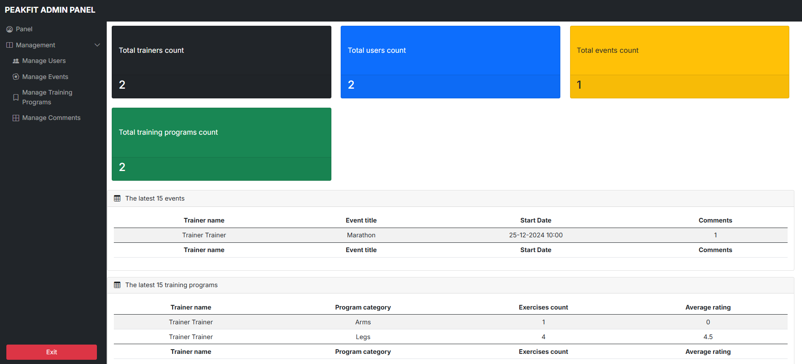
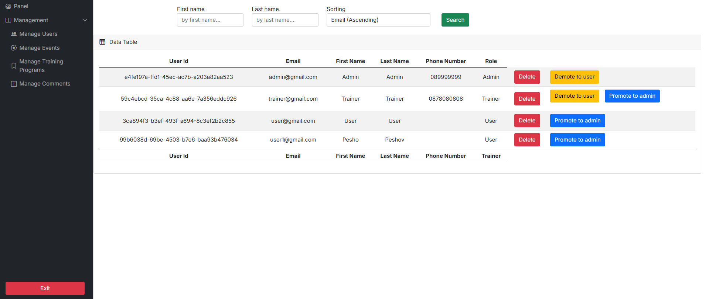
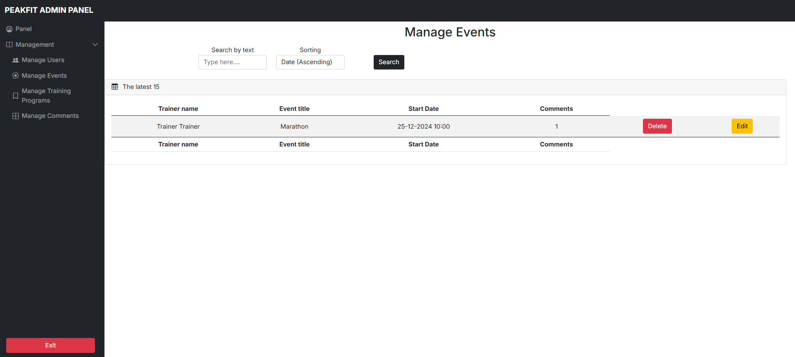
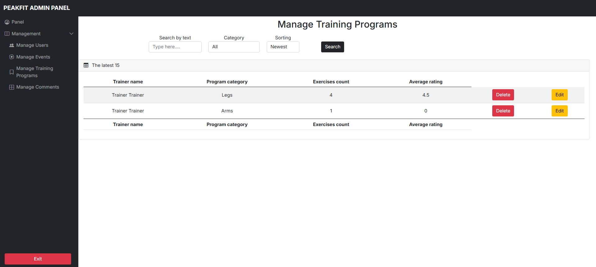
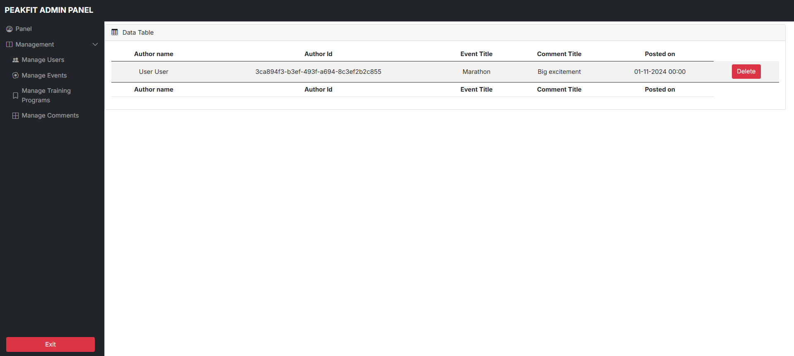
